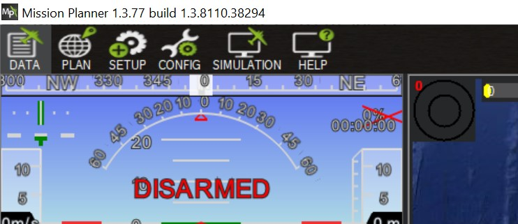
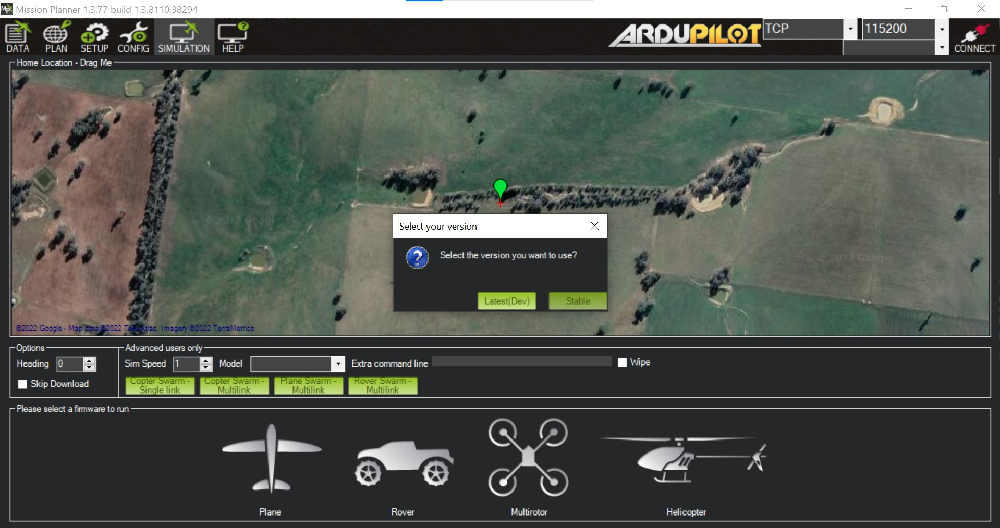
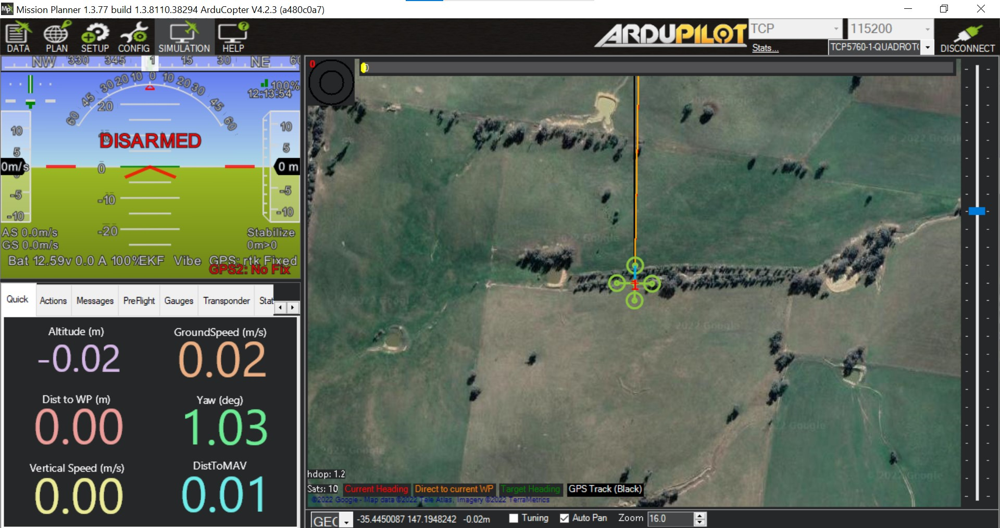
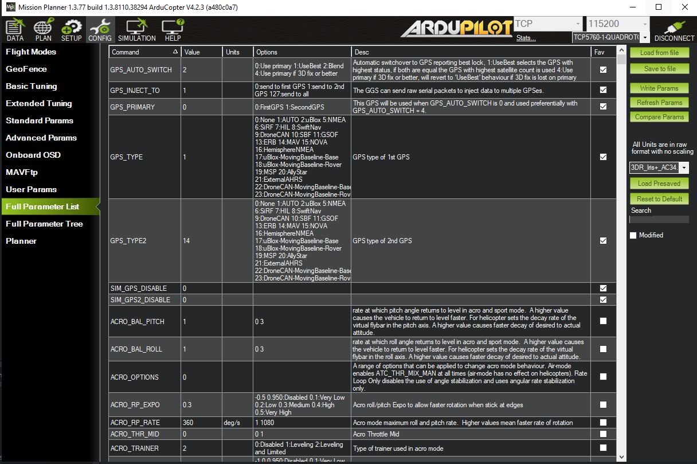

# SITL Simulation on desktop

Software in the Loop (SITL) can be used to simulate Ardupilot.

## Installing Mission Planner

Follow the instructions on the [Arudpilot website](https://ardupilot.org/planner/docs/mission-planner-installation.html) on how to install Mission Planner for different operating systems.

## Installing PyMavlink

Use the [pip](https://pip.pypa.io/en/stable/) to install PyMavlink.

```bash
pip install pymavlink
```

## Running SITL

Open Mission Planner and select the SIMULATION tab from the top menu.



Select the **multirotor** firmware and then choose the **stable** option.



A screen similar to the following should be displayed. From there the PLAN tab to can be used to create a flight plan through waypoints to simulate a basic test flight.

In the top right corner it displays the connection status and the port and baud rate being used. By default Mission Planner uses TCP connection with port 5760. This may need to be changed to either 5762 or 5763 depending on what port the software program uses as it needs to be using a different one to Mission Planner.

When pressing DISCONNECT the port being used and the connection type can be changed and then Mission Planner can reconnect to the simulation by pressing the CONNECT button.



To run **GPSInject-GetReults.py** the parameter list must first be altered in Mission Planner. Press the CONFIG tab then click on the Full Parameter List. Search GPS and alter the checked favourited fields as shown in the image below.

GPS_AUTO_SWITCH 2  
GPS_INJECT_TO 1  
GPS_PRIMARY 0  
GPS_TYPE 1  
GPS_TYPE2 14  
SIM_GPS2_DISABLE 0



# Jetson Nano

## Installing Jetson Nano OS

The jetson is now setup... how did we do this? Magic!

## Connecting to Ardupilot through PyMavlink

### Installing PyMavlink

Note: Running PyMavlink on Jetson Nano will require installing libxml2 and libxslt first

```bash
sudo apt-get install libxml2-dev libxslt-dev python-dev
```

```bash
pip3 install pymavlink
```
